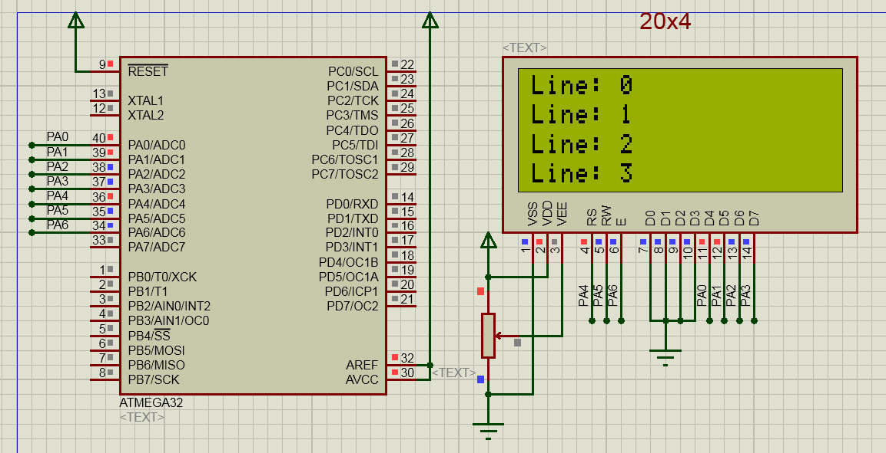

# avr-hd44780

4-bit HD44780 character LCD driver for AVR microcontrollers.

[](https://github.com/efthymios-ks/avr-hd44780/actions/workflows/ci.yml)

## Features
- 4-bit mode with freely-chosen pin assignments at compile time.
- Optional busy-flag polling when `HD44780_PIN_RW` is wired; fixed delays otherwise, so the library works on breadboard setups with RW tied to GND.
- Supports 1-, 2-, and 4-row displays with 8, 16, 20, or 40 columns, including the 16x1 split-DDRAM (`0x00..0x07 + 0x40..0x47`) variant.
- Prints strings from SRAM or PROGMEM, 32-bit signed integers, and floats with configurable decimal digits. `INT32_MIN` and leading-zero fractions handled correctly.
- Clean portable C99, no dynamic allocation, no globals except an optional test capture buffer.
- Builds with `-Wall -Wextra -Werror`.

## Supported MCUs and toolchain
Verified on ATmega328P (default, DIP-28) and ATmega32,  
built with avr-gcc using `-std=gnu99`.  
Host tests run on gcc under Linux or Windows (installed by `Build.ps1 -Test`).

## Wiring (default demo, ATmega328P DIP-28, 20x4 LCD)

Standard 16-pin character LCD, 4-bit mode.  
RW is tied to GND so the library runs with fixed delays.  
Backlight routed to a 220 Ω series resistor on pin 15.

| LCD pin | Signal | AVR pin            | DIP-28 | Config macro                 | Notes                             |
|--------:|--------|--------------------|-------:|------------------------------|-----------------------------------|
| 1       | VSS    | GND                | 8      | —                            | Ground                            |
| 2       | VDD    | +5V                | 7      | —                            | 5 V supply                        |
| 3       | V0     | contrast pot wiper | —      | —                            | 10 kΩ pot between VDD and GND     |
| 4       | RS     | PB0                | 14     | `HD44780_PIN_RS B, 0`        | Register select                   |
| 5       | RW     | GND                | 8      | leave `HD44780_PIN_RW` unset | Write-only mode                   |
| 6       | EN     | PB2                | 16     | `HD44780_PIN_EN B, 2`        | Enable strobe                     |
| 7..10   | D0..D3 | —                  | —      | —                            | Unused in 4-bit mode (leave open) |
| 11      | D4     | PD4                | 6      | `HD44780_PIN_D4 D, 4`        | Data bit 4                        |
| 12      | D5     | PD5                | 11     | `HD44780_PIN_D5 D, 5`        | Data bit 5                        |
| 13      | D6     | PD6                | 12     | `HD44780_PIN_D6 D, 6`        | Data bit 6                        |
| 14      | D7     | PD7                | 13     | `HD44780_PIN_D7 D, 7`        | Data bit 7                        |
| 15      | A      | +5V (via 220 Ω)    | 7      | —                            | Backlight anode (if fitted)       |
| 16      | K      | GND                | 8      | —                            | Backlight cathode (if fitted)     |

Define `HD44780_PIN_RW` to opt into busy-flag polling.

## Quick start

```c
#include <stdint.h>
#include "hd44780.h"

int main(void)
{
    hd44780_init();

    // Print a title on row 0.
    hd44780_goto(0, 0);
    hd44780_print_string("avr-hd44780 v2");

    // Print a signed integer on row 1.
    int32_t sample_count = -12345;
    hd44780_goto(0, 1);
    hd44780_print_int(sample_count);

    // Print a float with two decimal places on row 2.
    float voltage = 3.30f;
    hd44780_goto(0, 2);
    hd44780_print_float(voltage, 2);

    // Move the cursor and print another string on row 3.
    hd44780_goto(0, 3);
    hd44780_print_string("ready");

    while (1) { }
    return 0;
}
```

Full worked example in [`examples/demo.c`](examples/demo.c).

## API

### hd44780_init
- `void hd44780_init(void)`
- Does: configures the pins, runs the datasheet init sequence, and clears the display.
- Notes: must be called once before any other function. Includes the 50 ms power-on wait required by the HD44780 datasheet.

### hd44780_send_command
- `void hd44780_send_command(uint8_t command)`
- Does: sends a raw HD44780 command byte.
- Params: `command` is a datasheet command (e.g. `0x01` clear, `0x80 | address` set DDRAM address).
- Notes: busy-wait is handled internally. Prefer the higher-level helpers unless you specifically need the raw command.

### hd44780_send_data
- `void hd44780_send_data(uint8_t data)`
- Does: sends a raw data byte (writes to DDRAM or CGRAM at the current address).
- Notes: busy-wait handled internally.

### hd44780_clear
- `void hd44780_clear(void)`
- Does: clears the display and returns the cursor to position (0, 0).

### hd44780_clear_line
- `void hd44780_clear_line(uint8_t row)`
- Does: fills `row` with spaces and leaves the cursor at column 0 of that row.
- Params: `row` is 0-based.
- Notes: writes exactly `HD44780_COLUMNS` spaces.

### hd44780_goto
- `void hd44780_goto(uint8_t x, uint8_t y)`
- Does: moves the cursor to column `x`, row `y`.
- Notes: addresses are translated for 1-, 2-, and 4-row layouts and for the 16x1 split-DDRAM variant.

### hd44780_get_position
- `void hd44780_get_position(uint8_t *x, uint8_t *y)`
- Does: reads the current cursor position from the DDRAM address counter.
- Params: `x` and `y` receive the current column and row.
- Notes: requires `HD44780_PIN_RW` to be defined. Without RW the controller cannot be read.

### hd44780_create_char
- `void hd44780_create_char(uint8_t index, const uint8_t pattern[8])`
- Does: loads a 5x8 glyph from SRAM into CGRAM slot `index`.
- Params: `index` is 0..7; `pattern` holds 8 bytes, one per row, with the low 5 bits as the pixel pattern.
- Notes: the DDRAM address is left pointing into CGRAM afterwards. Call `hd44780_goto` before printing again.

### hd44780_create_char_p
- `void hd44780_create_char_p(uint8_t index, const uint8_t *pattern_pgm)`
- Does: same as `hd44780_create_char`, but reads the pattern from PROGMEM.
- Params: `pattern_pgm` is a `PROGMEM` pointer; the function reads 8 bytes via `pgm_read_byte`.

### hd44780_print_char
- `void hd44780_print_char(char glyph)`
- Does: writes one glyph at the cursor and advances the controller's internal position.

### hd44780_print_string
- `void hd44780_print_string(const char *text)`
- Does: writes a NUL-terminated string from SRAM, one glyph at a time.

### hd44780_print_string_p
- `void hd44780_print_string_p(const char *text_pgm)`
- Does: same as `hd44780_print_string`, but the string lives in flash (PROGMEM).
- Params: `text_pgm` is a `PROGMEM` pointer read via `pgm_read_byte`.

### hd44780_print_int
- `void hd44780_print_int(int32_t value)`
- Does: prints `value` as signed base-10 digits at the cursor.
- Notes: handles `INT32_MIN` (`"-2147483648"`) correctly.

### hd44780_print_float
- `void hd44780_print_float(float value, uint8_t decimals)`
- Does: prints `value` with `decimals` fractional digits, scaled to an integer with rounding.
- Params: `decimals` is 0..9 in practice; larger values quickly overflow the float mantissa.
- Notes: preserves leading zeros in the fractional part (`1.05f, 2` prints `"1.05"`, `0.3f, 1` prints `"0.3"`).

## Configuration

### HD44780_COLUMNS
- `#define HD44780_COLUMNS 20`
- Does: sets the column count. Typical values are 8, 16, 20, or 40.

### HD44780_ROWS
- `#define HD44780_ROWS 4`
- Does: sets the row count. Must be 1, 2, or 4.
- Notes: compile fails if set to any other value.

### HD44780_16X1_SPLIT
- `#define HD44780_16X1_SPLIT 0`
- Does: selects the DDRAM layout for 16x1 modules.
- Notes: set to 1 for 16x1 modules that behave as 8+8 internally (DDRAM `0x00..0x07` then `0x40..0x47`). Leave at 0 for the contiguous `0x00..0x0F` variant.

### HD44780_PIN_RS
- `#define HD44780_PIN_RS B, 0`
- Does: pin for the Register Select line. Written as two tokens: port letter + bit.

### HD44780_PIN_RW
- `// #define HD44780_PIN_RW B, 1`
- Does: pin for the Read/Write line.
- Notes: optional. Leave undefined to run write-only with fixed delays (RW tied to GND). Define to enable busy-flag polling; required for `hd44780_get_position`.

### HD44780_PIN_EN
- `#define HD44780_PIN_EN B, 2`
- Does: pin for the Enable strobe.

### HD44780_PIN_D4, HD44780_PIN_D5, HD44780_PIN_D6, HD44780_PIN_D7
- `#define HD44780_PIN_D4 D, 4` (defaults: `D, 4` through `D, 7`)
- Does: pins for the four data lines used in 4-bit mode.

## Memory usage
Build.ps1 writes `build/size.txt` on every build;  
Before/after comparison on ATmega32 (v1's historical target).

| Build | Flash / RAM |
|-------|------------:|
| v1 (ATmega32, -Os) | 1342 B / 0 B |
| v2 (ATmega32, -Os) | 2706 B / 6 B |

## Build, test, simulate

```powershell
.\Build.ps1
.\Build.ps1 -AllMcus -DebugBuild
.\Build.ps1 -Test
.\Simulate.ps1
.\Simulate.ps1 -NoLaunch
```

`Build.ps1` installs the AVR toolchain (and host gcc for `-Test`) on first run into a per-user cache,  
with no admin and no system-wide `PATH` changes.  
Add `-RemoveTools` to uninstall what the script installed;  
pass `-NoInstall` to fail loudly instead for air-gapped or CI use.

## Limitations
- 4-bit mode only. Add 8-bit mode by extending the internal nibble path to a `send_byte` driving all eight data pins.
- Single-controller layouts only. 40x4 displays with two EN pins are not supported.
- `hd44780_get_position` requires `HD44780_PIN_RW` to be defined; without RW there is no way to read the DDRAM address counter.

## Datasheets
- `docs/datasheets/hd44780u.pdf` — Hitachi HD44780U reference.
- `docs/datasheets/lcd-addressing.pdf` — vendor addressing summary.
- `docs/datasheets/lcd-initialization.pdf` — 4-bit init sequence timing.
- `docs/lcd-addressing.md` — quick DDRAM map for every supported geometry.



## Changelog and license
See [CHANGELOG.md](CHANGELOG.md).  
MIT — see [LICENSE](LICENSE).
